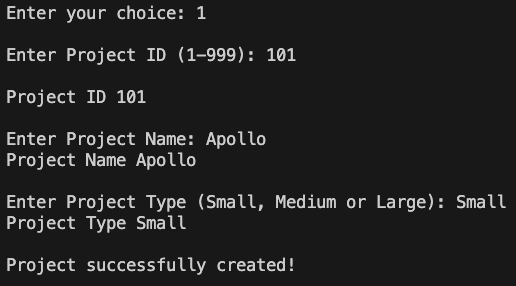
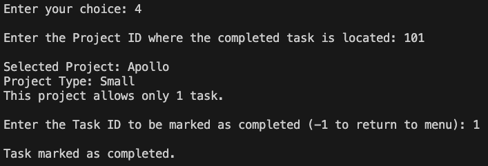
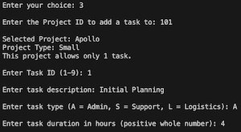
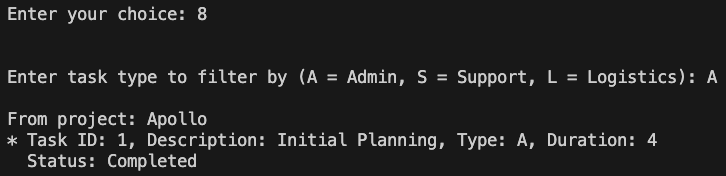
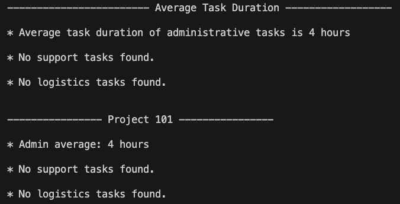

# Project Management System – SENG1110 Assignment 1 Report for Reece Doyle - c3033554

---

### Design and Planning

After completing the **HowToStartAssign1.pdf** tutorial, it was clear that the task was to build a method for each case in the menu's switch statement. I created a GitHub repository to support an iterative design approach that could be rolled back if needed and to help track progress and error handling through regular commits.

To track progress efficiently, I created a README with all constraints and requirements of the assignment, using checkboxes to visually manage the implementation process.

---

### Time Tracking

I spent approximately **26 hours** on the assignment: around **2 hours** on design and planning, **16 hours** on coding and implementation, **6 hours** on testing and debugging, and **2 hours** on the README and report.

---

### Errors and Debugging

I encountered various input validation and menu interaction issues during development. To streamline debugging, I created a `seedDummyData()` method (left commented in the final submission) and a manual test walkthrough that triggered all error messages. This ensured edge cases were handled and user input was validated. Most bugs (**~70%**) were coding issues like scanner handling and off-by-one logic; the rest (**~30%**) were early design oversights. Regular GitHub commits tracked fixes and progress.

---

### Object-Oriented Class Relationships

The program uses three simple classes: `UserInterface` controls the flow of the program and handles all user input/output, `Project` stores project details and up to three `Task` objects, and `Task` holds the data for individual tasks. Each class is self-contained with getters and setters, allowing `UserInterface` to manage the interaction between them.

---

## Program Screenshots

### Creating and Completing a Task

  
  

---

### Adding a Task and Filtering by Task Type

  
  

---

### Project Summary Report

  

---

## Use of Disallowed Topics

To the best of my knowledge, the only elements I used that weren't covered in the course materials were the `String.matches()` method with a regular expression to verify if a string contains only digits, and the `String.isEmpty()` method to check for empty input. These were essential for robust input validation during development.

I adopted these solutions because I couldn't think of another way to solve the problems I was encountering during debugging. For example, to ensure that a string contained only digits, I used a regular expression like `input.matches("\\d+")`, which I found via Stack Overflow ([source](https://stackoverflow.com/questions/40561012/method-to-see-if-string-contains-all-digits?utm_source=chatgpt.com)). Similarly, to check if a string was empty, I used `input.isEmpty()` ([source](https://stackoverflow.com/questions/14721397/checking-if-a-string-is-empty-or-null-in-java?utm_source=chatgpt.com)).

These methods may not have been explicitly covered in class, but they were straightforward, efficient, and necessary to ensure a smooth user experience. I discovered and applied them as part of my iterative development and troubleshooting process.

---