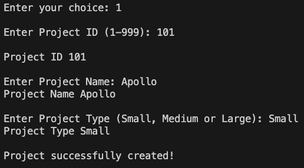
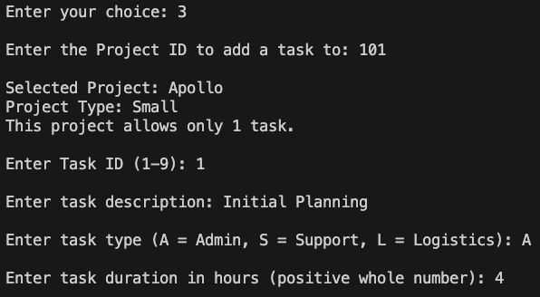
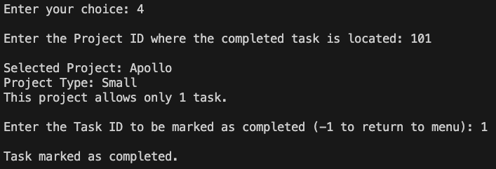
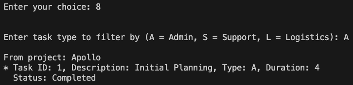
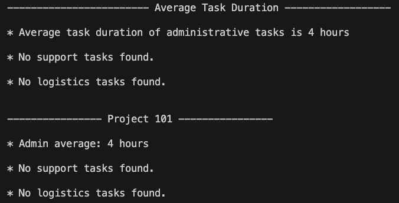

## Project Management System – SENG1110 Assignment 1 Report for Reece Doyle - c3033554

### Design and Planning

After completing the **HowToStartAssign1.pdf** tutorial, it was clear that the task was to build a method for each case in the menu's switch statement. I created a GitHub repository to support an iterative design approach that could be rolled back if needed and to help track progress and error handling through regular commits.

To track progress quickly, I created a README with all contraints and requirements of the assignment with boxes I could check off. 

---

### Time Tracking
I spent approximately **26 hours** on the assignment: around **2 hours** on design and planning, **16 hours** on coding and implementation, **6 hours** on testing and debugging, and **2 hours** on the README and report.

---

### Errors and Debugging
I encountered various input validation and menu interaction issues during development. To streamline debugging, I created a `seedDummyData()` method (left commented in the final submission) and a manual test walkthrough that triggered all error messages. This ensured edge cases were handled and user input was validated. Most bugs (~70%) were coding issues like scanner handling and off-by-one logic; the rest (~30%) were early design oversights. Regular Git commits tracked fixes and progress.

---

## Object-Oriented Class Relationships

The program uses three simple classes: `UserInterface` controls the flow of the program and handles all user input/output, `Project` stores project details and up to three `Task` objects, and `Task` holds the data for individual tasks. Each class is self-contained with getters and setters, allowing `UserInterface` to manage the interaction between them.

---

## Program Screenshots

---

## Program Screenshots

### Creating a Project

---

### Adding a Task to a Project

---

### Marking a Task as Completed

---

### Filtering Tasks by Type

---

### Project Summary Report

---

## Use of Disallowed Topics

## Use of Disallowed Topics

To the best of my knowledge, the only elements I used that weren't covered in the course materials were the `String.matches()` method with a regular expression to verify if a string contains only digits, and the `String.isEmpty()` method to check for empty input. These were essential for robust input validation during development.

I adopted these solutions after encountering issues with user input that could cause the program to behave unexpectedly or crash. For instance, to ensure that a string contained only digits, I used a regular expression like `input.matches("\\d+")`, which I found through resources such as Stack Overflow ([source](https://stackoverflow.com/questions/40561012/method-to-see-if-string-contains-all-digits?utm_source=chatgpt.com)). Similarly, to check if a string was empty, I employed `input.isEmpty()`, a straightforward and efficient method ([source](https://stackoverflow.com/questions/14721397/checking-if-a-string-is-empty-or-null-in-java?utm_source=chatgpt.com)).

These methods may not have been covered in the course content, but I found them necessary to handle specific input validation scenarios effectively. I discovered them through online research, primarily Stack Overflow, as part of my iterative development and debugging process.

---

Let me know if you want a skeleton with placeholders for each screenshot too.